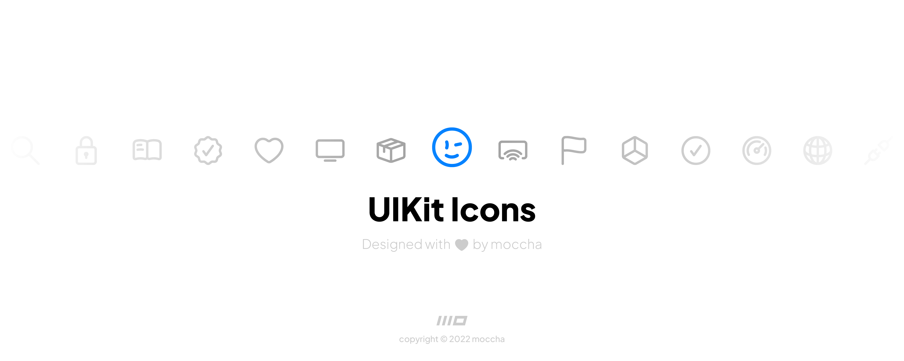
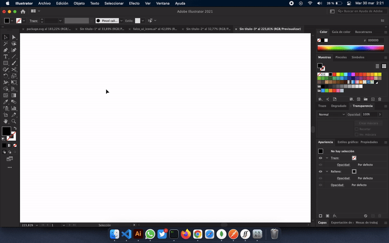
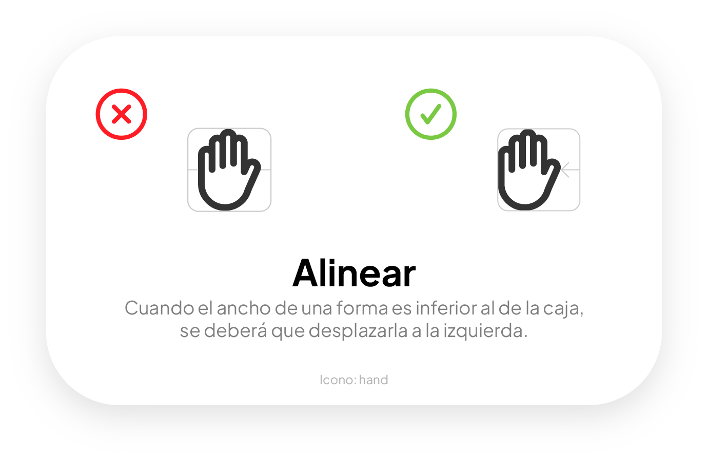
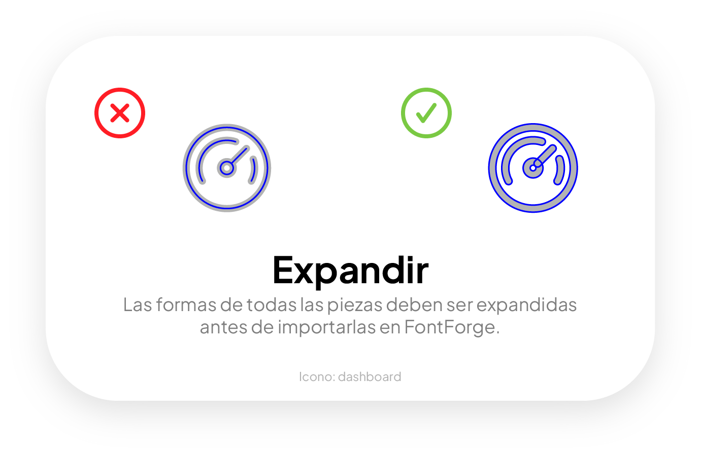

<div align="center">
    
    <h1>UIKit Icons</h1>
    <p>
        UIKit Icons es una fuente de iconos SVG compatible con ligaduras diseñada para toda la plataforma moccha.
        <br>
        Diseñada con Adobe Illustrator y ensamblada con FontForge.
    </p>
</div>


<div align="center">
    
</div>

Los iconos están basados en un documento de `100x100` pixeles, usando `8pt` de grosor para el trazo, las esquinas van redondeadas a `8px` y todos los documentos `.ai` incluyen unas guías para mantener el margen de `4pt`, para evitar que el trazo del icono desborde del documento. Además, ahora UIKit Icons es aún más redonda, para ello se redondea los remates.

En algunas esquinas complejas a `45º`, el trazo suele desbordar con los puntos de ancla, en este caso hay que realizar algunos ajustes.
De la misma forma ocurre con los segmentos que alcanzan los bordes del documento.

# ⚠️ Directivas

## 📂 Espacio de trabajo

A la hora de trabajar en nuevos iconos se debe tener en cuenta la siguiente estructura:

```
┌─────────────┐
│    icons    │
├─────────────┘
├─ normal (deprecated)
│
├─ outlined (deprecated)
│
└┬ rounded
 │
 ├─ pending (Especial - Iconos pendientes por
 │           rediseñar.)
 │
 ├─ strokes (trazos - Solo Illustrator)
 │
 ├─ svg (Archivos expandidos - Solo SVG)
 │
 └─ stage (Especial - Para crear nuevas variantes
           en base a otras)
```
Cuando se está diseñando una nueva variante o peso, será necesario copiar toda la carpeta de un peso y renombrar la carpeta ```strokes``` por ```pending```. A partir de ahí empezar a trabajar.

Cuando se diseñan iconos es normal realizar una serie de varios sin pararse a importarlos en FontForge, para no perder referencias de iconos rediseñados, la mejor opción es crear la carpeta ```stage```, en ella guardaremos los iconos como trazos de illustrator (**sin expandir**).
Finalmente, cuando se haya terminado, convertir los trazos a formas expandidas, formatearlas como svg y guardarlas en la carpeta correspondiente (```svg```).

## 📐 Alineación del glifo
Los glifos deben ir alineados al borde izquierdo del icono en FontForge y el ancho se establece al límite derecho.

Las dimensiones del glifo equivalen al ancho del icono, es decir, no se alinea al centro, se ajusta al borde izquierdo del glifo y después se establece el ancho para que sea igual al del icono.
Esto evita que haya espacios innecesarios cuando se usen los iconos, de lo contrario se trataría de una fuente monoespaciada.

<div align="center">
    
</div>

Cuando el espaciado está bien establecido, la alineación del icono no tendrá esos espacios vacíos. Esto es especialmente útil a la hora de implementarlo en el frontEnd.

```HTML
<!-- Ejemplo de uso -->
<h1><span>remote_control</span> Remote Control</h1>
```

En este caso, no será lo mismo el espacio que hay inmediatamente después del cierre del `span`, que ese mismo espacio mas el que sobra del borde izquierdo del glifo.

## ✳️ Expandir formas

Cuando un icono está preparado para ser importado en FontForge, deberá ser expandido para este pueda ser interpretado de forma correcta.

<div align="center">
    
</div>

El proceso de expansión se trata de convertir trazos en formas con relleno, para hacer esto en Adobe Illustrator, abrir el menú Objet y pulsar Expand...


## 🖼 Documento base

En la carpeta de iconos hay un archivo llamado `base.ai`, este tiene las cuadrícula básica para empezar a diseñar.

Para diseñar un icono, primero hay que crear un documento de `100x100px` como se ha mencionado antes.
Establecer las guías de `4px` para cada borde, usar `8pt` de ancho de trazo y asegurarse de redondear las esquinas necesarias a `8px`.
> La esquinas redondeadas influyen mucho en cómo se ve el icono, un diseño orgánico siempre será más agradable a uno con vértices angulados.

Es importante que el icono conserve el mismo estilo: trazos gruesos; espaciado del ancho del trazo en la medida de lo posible; vértices redondeados a 6px cuando sea posible; claridad y simplicidad.

Tambien es importante que el icono no desborde del documento, pues es el mayor signo de que probablemente no sea apto para su uso y a la hora de implementarlo en la interfaz, provocará problemas visuales (aunque a veces hay excepciones).